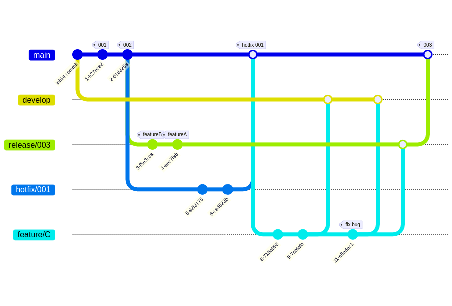

# Gitflow

Elements:
- The main branch corresponds to the product
- Development branch - corresponds to development versions for preliminary testing.
- Hotfix is necessary to quickly fix errors in production
- Release branches are merged when a new version is released that contains all the features of the release.
- A feature branch is created for each task

The developer first merges into the dev branch, tests, then merges into the release branch and tests before release, then merges into the master branch